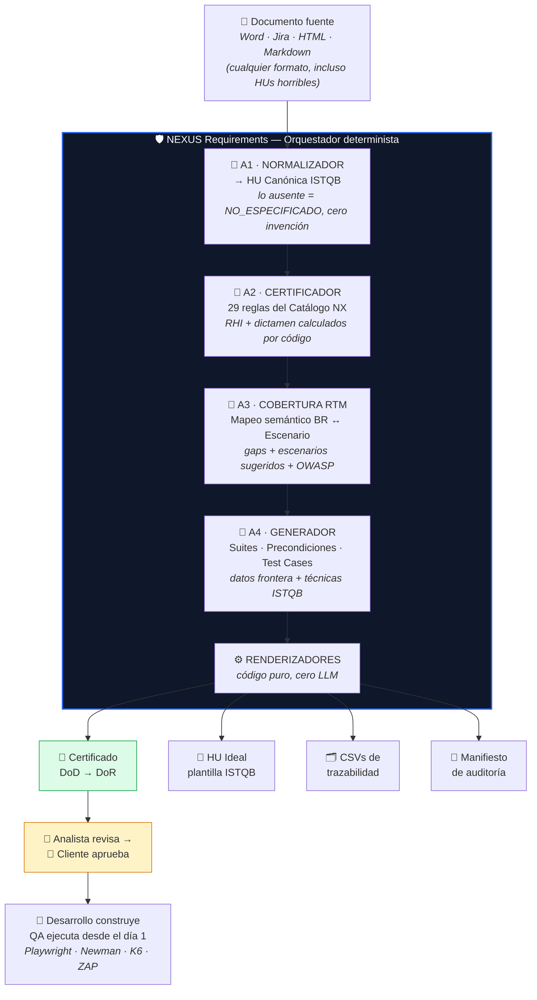
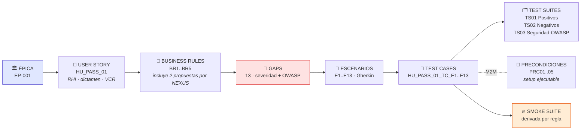

<div align="center">

# 🛡️ NEXUS Requirements

### Motor de Certificación de Requerimientos con IA · Calidad Predictiva

**El framework define la norma; NEXUS la ejecuta; el ecosistema la consume.**

[]()
[]()
[]()
[]()
[]()
[]()
[](https://e-gregorio.github.io/qa-shiftleft-methodology/)

*Parte del ecosistema **QASL** · Implementación ejecutable del [QASL Shift-Left Testing Framework](https://e-gregorio.github.io/qa-shiftleft-methodology/)*

</div>

---

## 💡 El problema que nadie ataca

Las herramientas de testing de la industria — Playwright, Cypress, Postman, JMeter, K6 — operan donde el defecto **ya existe**. Pero los defectos más caros no nacen en el código: nacen en el **requerimiento**. Una Historia de Usuario que dice *"el link expira rápido"* o *"la contraseña debe ser segura"* es intesteable, y su ambigüedad se convierte en bugs de QA, presión del cliente y "bugs conocidos" pasando a producción.

**NEXUS Requirements interviene antes de la primera línea de código:** certifica la HU contra una norma pública, detecta los gaps de cobertura, genera la HU ideal corregida y deja los casos de prueba listos para el primer despliegue.

```
Reactivo:    Requerimiento ambiguo → Código → Bugs en QA → Presión → "Bugs conocidos" en UAT
Predictivo:  Requerimiento CERTIFICADO → Código → Los bugs de requerimiento nunca existieron
```

---

## 🔬 Resultado real (corrida verificada del motor)

Entrada: una HU de **3 viñetas ambiguas** (`demo/HU_PASS_01_original.md`). Salida, sin intervención humana, en ~6 minutos y centavos de dólar de API:

| Artefacto | Resultado |
|---|---|
| 📋 **Dictamen normativo** | `NO_APTO` · **RHI 23.7/100** (22/93 puntos ponderados, cálculo auditable) |
| 🚨 **Reglas críticas violadas** | 6 — BRs sin numerar, sin Gherkin, no verificables, 0% cobertura, sin seguridad |
| 🔍 **Gaps detectados** | **13** con severidad y referencia OWASP (A07 anti-enumeración · A09 auditoría) |
| ➕ **BRs nuevas propuestas** | 2 — rate limiting por IP (anti fuerza bruta) y retención de logs 90 días |
| 🧪 **Test Cases generados** | **13** con datos frontera reales (token 29'/30'/31' · password 11/12 chars · timing ±50ms) |
| 🗂️ **Suites / Precondiciones** | 3 suites (Positivos · Negativos · Seguridad-OWASP) · 5 PRCs con setup ejecutable |
| ⚖️ **VCR** | V3+C2+R9 = **14 → AUTOMATIZAR** (propuesto, ratificable en Planning Poker) |
| ✅ **Trazabilidad** | **22/22 verificaciones de integridad referencial** — IDs deterministas e idempotentes |
| 📜 **Certificado DoD→DoR** | Dictamen + decisiones de negocio + bloque de aprobaciones (Analista · QA Lead · Cliente) |

> Cobertura de prueba: **0% → 100% proyectada, antes de escribir una sola línea de código.**

---

## ⚙️ El pipeline



### Principios de diseño no negociables

| Principio | Implementación |
|---|---|
| 🧠 **El LLM decide, el código ejecuta** | RHI, VCR, dictamen, IDs y regla smoke: aritmética pura, jamás el modelo |
| 🚫 **Prohibido inventar** | Campos ausentes = `NO_ESPECIFICADO`; todo valor propuesto marcado `[PROPUESTO]` para confirmación del negocio |
| 📜 **Contratos entre etapas** | JSON Schema valida la salida de cada agente; coerciones deterministas + reintento con feedback |
| 🔊 **Sin fallback silencioso** | Falla de API o contrato = corrida `FALLIDA` visible; nunca un análisis vacío disfrazado de válido |
| 🔁 **Idempotencia por diseño** | IDs derivados del contenido (`HU_PASS_01_TC_E1`): re-analizar actualiza, no duplica |
| ✍️ **Los humanos firman** | NEXUS prepara la evidencia; Analista, QA Lead y Cliente aprueban |

---

## 🔗 Trazabilidad completa antes del primer despliegue



Cuando un TC falla en ejecución, el diagnóstico viene incluido: el TC traza a su escenario, el escenario a su BR, la BR a la HU **certificada y aprobada por el cliente**. El reporte de defecto se escribe solo — y la discusión "¿esto era un bug o nunca se especificó?" desaparece.

**Integridad verificada en la corrida real: 22/22 checks** — formato de IDs, referencias TC→Suite/PRC/Escenario/BR, consistencia bidireccional Suite↔TC y PRC↔TC, cadena vertical completa.

---

## 📏 La norma ejecutable: Catálogo NX

La base normativa no es un prompt: es un **catálogo versionado de 29 reglas verificables** (`catalog/nx_rules.yaml`), derivado del [QASL Shift-Left Testing Framework](https://e-gregorio.github.io/qa-shiftleft-methodology/) y sus estándares:

| Familia | Reglas | Evalúa | Evaluador |
|---|---|---|---|
| 🏗️ **Estructura** | NX-001..013 | Los 16 campos de la plantilla US ISTQB | Código (determinista) |
| ✍️ **Redacción** | NX-020..025 | Ambigüedad, verificabilidad, contradicciones (ISO 29148) | LLM |
| 🧪 **Testabilidad** | NX-030..035 | 1 BR = positivo + negativo · límites · seguridad OWASP | Mixto |
| 🔒 **NFR/Compliance** | NX-040..043 | Performance, WCAG, auditoría, regulatorio | LLM |

```
RHI = 100 × Σ(peso × cumplida) / Σ(peso)        pesos: CRÍTICO=5 · ALTO=3 · MEDIO=2 · BAJO=1

CERTIFICADO (100) · APTO (≥90, sin críticos) · REQUIERE REVISIÓN (≥60) · NO APTO (<60 o críticos)
```

El dictamen no es la opinión de una IA: es el **incumplimiento verificable de reglas numeradas** — como un linter, pero de requerimientos.

---

## 🚀 Quickstart

```bash
cd engine
pip install -r requirements.txt
copy .env.example .env            # completar ANTHROPIC_API_KEY

# Verificación offline (sin API — evals contra el golden set)
python tests/test_offline.py      # → TODOS LOS CHECKS PASARON ✔

# Análisis completo de una HU
python run_nexus.py ..\demo\HU_PASS_01_original.md
```

Salidas en `outputs/<HU_ID>/`: HU canónica → certificación NX → gaps → activos → **Certificado** + **HU Ideal** + **CSVs** + manifiesto de auditoría.

---

## 🧪 QA del motor de QA

El motor se certifica con la propia metodología que implementa (guía de Testing IA/LLM del framework):

- **Golden set** (`demo/`): corrida de referencia certificada a mano — el estándar que la salida automática debe igualar.
- **Evals offline** (`tests/test_offline.py`): sin consumir API, verifica que la evaluación estructural, el RHI (23.9 → NO_APTO), el VCR, los IDs deterministas, la regla smoke y los 11 artefactos reproducen el golden set exactamente.
- **Eval online verificado**: el motor en vivo reprodujo el dictamen del golden (RHI 23.7 vs 23.9, mismos 6 críticos) y detectó *más* gaps que el análisis manual — incluyendo timing attacks y rate limiting que ningún analista escribe espontáneamente.

---

## 📂 Estructura del proyecto

```
nexus-requirements/
├── catalog/          # La norma ejecutable: nx_rules.yaml (29 reglas) · vcr_policy.yaml
├── schemas/          # Contratos JSON entre etapas (4 schemas)
├── engine/           # El motor: orquestador + 4 agentes + renderizadores + evals
├── demo/             # Golden set: HU horrible → todos los artefactos certificados
├── outputs/          # Corridas reales del motor
└── docs/             # Blueprint de arquitectura completo
```

---

## 🗺️ Roadmap

- [x] **Fase 0** — Catálogo NX · política VCR · JSON Schemas · golden set
- [x] **Fase 1-2** — Motor completo (A1-A4) · renderizadores · evals offline · **primera corrida real certificada**
- [ ] **Fase 3** — Persistencia en PostgreSQL (MS-12, single source of truth) · export CSV por vistas · versionado de HU
- [ ] **Fase 4** — Dashboard de métricas · integración con motores de ejecución (Playwright/Newman/K6/ZAP)

---

<div align="center">

## 👤 Autor

**Elyer Gregorio Maldonado** · Senior QA Automation Lead

Creador del [QASL Shift-Left Testing Framework](https://e-gregorio.github.io/qa-shiftleft-methodology/) y del ecosistema QASL

[](https://linkedin.com/in/elyergregorio)
[](https://github.com/E-Gregorio)
[](https://e-gregorio.github.io/mi-portafolio)

*"El éxito de QA no se mide solo por los bugs que encuentra, sino por los que impide que existan."*

</div>
